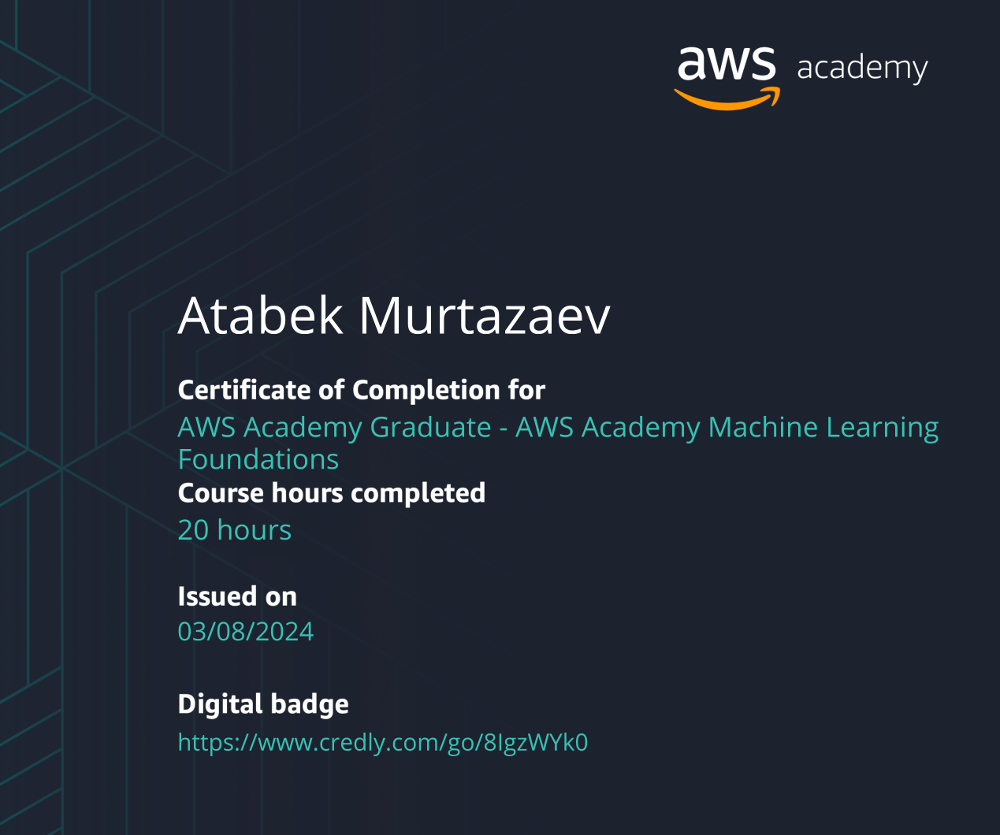

# Applications of Machine Learning (2023 MOD006567 TRI2 F01CAM)

This repository contains the code and materials for the Applications of Machine Learning course offered in the 2023 MOD006567 TRI2 F01CAM semester. Each week's topic and corresponding files are listed below.

## Weeks Overview

### Week 1: mnist-log-reg.ipynb

- Description: Introduction to logistic regression with the MNIST dataset.
- Files:
  - [mnist-log-reg.ipynb](week1/mnist-log-reg.ipynb)

### Week 2: mnist

- Description: Implementation and analysis of different models on the MNIST dataset.
- Files:
  - [mnist/](week2/)

### Week 3: ImageProcessing

- Description: Introduction to image processing techniques in machine learning.
- Files:
  - [ImageProcessing/](week3/)

### Week 4: DeepDream

- Description: Exploring the DeepDream algorithm for visualizing neural networks.
- Files:
  - [DeepDream/](week4/)

### Week 5: text-gen-nlp

- Description: Natural Language Processing (NLP) for text generation.
- Files:
  - [text-gen-nlp/](week5/)

### Week 6: nlp

- Description: Introduction to Natural Language Processing (NLP) techniques.
- Files:
  - [nlp/](week6/)

### Week 7: speech-recognition

- Description: Implementation of speech recognition using machine learning.
- Files:
  - [speech-recognition/](week7/)

### Week 8: Financial-Application

- Description: Applications of machine learning in finance.
- Files:
  - [Financial-Application/](week8/)

### Week 9: lungsound-classification

- Description: Classification of lung sounds using machine learning.
- Files:
  - [lungsound-classification/](week9/)

### Week 10: Recommendation system

- Description: Implementation of a recommendation system using machine learning.
- Files:
  - [Recommendation system/](week10/)

## Prerequisites

- Python
- Jupyter Notebook (optional)
- Libraries mentioned in each week's notebook or code files

## License

AWS LICENSE [License](LICENSE.pdf).

## Acknowledgements

- List any acknowledgements or credits for resources used in the course.
